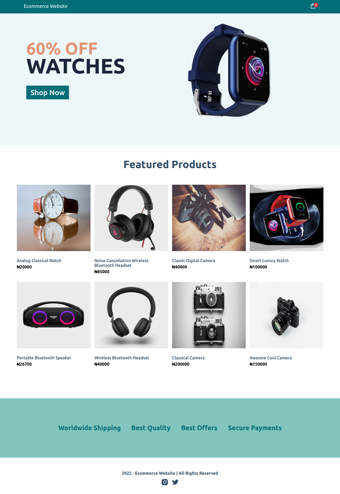

<!-- @format -->

# Simple Ecommerce Website with Sanity CMS

# What I learnt/Tool Used:

<ul>
<li>NextJS</li>
<li>Sanity CMS</li>
<li>PayStack Payment Integration

</ul>

# URL

<a href="https://ecommerce-cms.vercel.app/" target="_blank">
https://ecommerce-cms.vercel.app/
</a>
 

